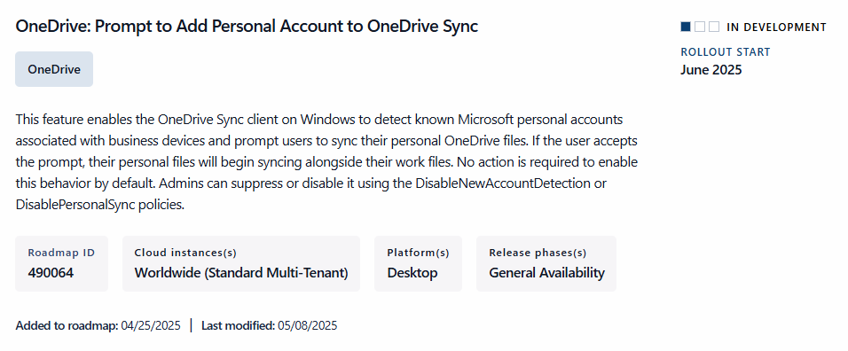

# ConfigMgr 2409 - Post Upgrade Issue

Errors such as "Cannot insert duplicate key in object 'dbo.CI\_DocumentStore'" were found in the logs, indicating duplicate key values. This blog post provides a solution involving SQL commands to reset the identity value of the `CI_DocumentStore` table, ensuring smooth operation. Follow the steps to resolve these issues, remember to back up your database and consult your SQL admin or Microsoft Support.

In the following example, when attempting to copy an application, an error occurred: "Permission denied to modify the folder. Application ### has been copied to the root folder."

<figure><figcaption></figcaption></figure>

When reviewing the "SMSProv.log" file located in "Program Files\Microsoft Configuration Manager\Logs", the error message "Cannot insert duplicate key in object 'dbo.CI\_DocumentStore'. The duplicate key value is (33554719)"

<figure><figcaption></figcaption></figure>

In the wsyncmgr.log file located "Program Files\Microsoft Configuration Manager\Logs", an issue is visible: "Cannot insert duplicate key in object 'dbo.CI\_DocumentStore'. The duplicate key value is (33554717)

<figure><figcaption></figcaption></figure>

To view the record stored in the database under Document\_ID 33554717, use this SQL command to list the entry and inspect its XML body.

\
.png>)

To resolve this issue, execute a two SQL commands as instructed by Microsoft Support.\
\*\*Note: No warranty is provided. Please back up your database, take a snapshot, and consult your SQL admin or consult Microsoft directly.

\
`DBCC CHECKIDENT('CI_DocumentStore')`

Checking identity information: current identity value '33554719', current column value '33564282'.
\
DBCC execution completed. If DBCC printed error messages, contact your system administrator.

**Identity Verification Process**

The current identity value is `33554719`, while the current column value is `33564282`.

`DBCC CHECKIDENT('CI_DocumentStore',RESEED, 33564282)`

.png>)

The command `DBCC CHECKIDENT('CI_DocumentStore', RESEED, 33564282);` is used in SQL Server to reset the identity value of the specified table, `CI_DocumentStore`, to a specific number, in this case, 33564282.

Here's a breakdown of what each part does:

* **`DBCC CHECKIDENT`**: This is a Database Console Command (DBCC) used to check and reset the identity value of a table.
* **`'CI_DocumentStore'`**: This specifies the name of the table whose identity value you want to reset.
* **`RESEED`**: This option resets the current identity value.
* `33564282` : This is the new identity value that you want to set for the table.

After executing this command, the next row inserted into the `CI_DocumentStore` table will have an identity value of 33564283.\
