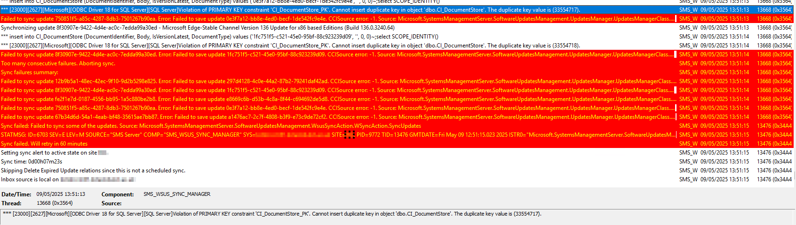

# OneDrive: Prompt to sync personal OneDrive

#### You may have seen Microsoft's roadmap in which users will receive a prompt to sync their personal OneDrive files  [https://www.microsoft.com/en-us/microsoft-365/roadmap?searchterms=490064](https://www.microsoft.com/en-us/microsoft-365/roadmap?searchterms=490064) 

<figure><figcaption></figcaption></figure>

Microsoft's roadmap includes a prompt for users to sync their personal OneDrive files. To prevent users from syncing personal OneDrive accounts, you can enable a setting that blocks users from signing in with a Microsoft account to sync their personal OneDrive files. If you prefer to allow syncing but want to avoid prompts that might confuse users, you can hide messages encouraging users to sync Consumer OneDrive files.

#### The general advice is to Prevent users from syncing personal OneDrive accounts [https://learn.microsoft.com/en-us/sharepoint/use-group-policy#prevent-users-from-syncing-personal-onedrive-accounts](https://learn.microsoft.com/en-us/sharepoint/use-group-policy#prevent-users-from-syncing-personal-onedrive-accounts) 

This setting lets you block users from signing in with a Microsoft account to sync their personal OneDrive files. By default, users are allowed to sync personal OneDrive accounts.

If you enable this setting, users are prevented from setting up a sync relationship for their personal OneDrive account. Users who are already syncing their personal OneDrive when you enable this setting can't continue syncing (they receive a message that syncing has stopped), but any files synced to the computer remain on the computer.

Enabling this policy sets the following registry key value to 1:

`[HKCU\SOFTWARE\Policies\Microsoft\OneDrive]"DisablePersonalSync"=dword:00000001`

## This settings is available in Intune policy via Settings Catalog

<figure><figcaption></figcaption></figure>

## However, you may be happy with the ability to sync personal OneDrive but you don't want the prompt to encourage or confuse the end user.

#### Hide the messages to sync Consumer OneDrive files [https://learn.microsoft.com/en-us/sharepoint/use-group-policy#hide-the-messages-to-sync-consumer-onedrive-files](https://learn.microsoft.com/en-us/sharepoint/use-group-policy#hide-the-messages-to-sync-consumer-onedrive-files) 

This setting determines whether a user will be prompted to sync their Consumer files when a Microsoft Account (MSA) is detected on the device.

If you enable this setting, users will not be prompted to sign in with their MSA and sync their Consumer files. Users can still manually configure their Consumer accounts to sync their OneDrive Consumer files. Enabling this policy sets the following registry key value to 1:

`[HKLM\SOFTWARE\Policies\Microsoft\OneDrive]"DisableNewAccountDetection"=dword:00000001`

If you disable this setting or do not configure it, users will be prompted to sign in with their MSA and sync their Consumer files.

This setting for what ever reason is not in the Intune Setting Catalog and is only available in the ADMX file  (at time of writing the blog) . You have to import the ADMX into Intune and then create a `Imported Administrative templates (Preview)`  profile.

&#x20;You will find the ADMX and ADML file here on a Windows 11 client to import: `%ProgramFiles%\Microsoft OneDrive\BuildNumber\adm\`

<figure><figcaption></figcaption></figure>

<figure><figcaption></figcaption></figure>

In addition, finding the setting in the ADMX is also confusing, you will need to search for `"Disable a toast and activity center message to encourage a user to sign in OneDrive using an existing credential that is made available to Microsoft applications"`\

<figure><figcaption></figcaption></figure>

Once the policy has applied the client will receive the registry key

`[HKLM\SOFTWARE\Policies\Microsoft\OneDrive]"DisableNewAccountDetection"=dword:00000001`

<figure><figcaption></figcaption></figure>
